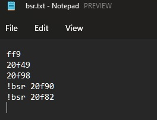

# beat-saber-playlist-to-hash

Converts beat saber playlist code to map hash

## How to use

1. Download from [Latest release](../../releases/latest)
2. Drag drop a text file with list of bsr code (one per line) into `BeatSaberPlaylistToHash.exe`

A sample of how the txt file looks like

